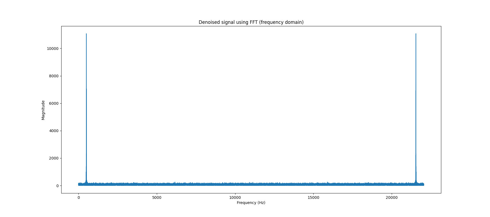
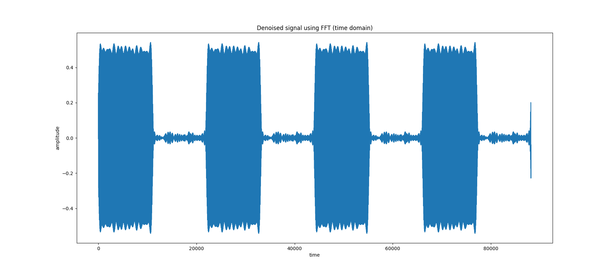
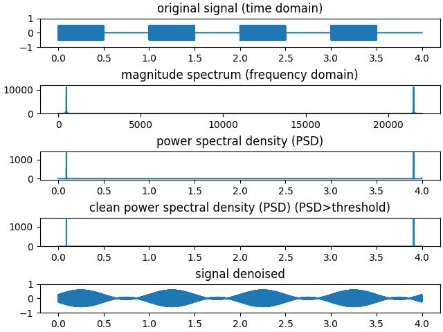
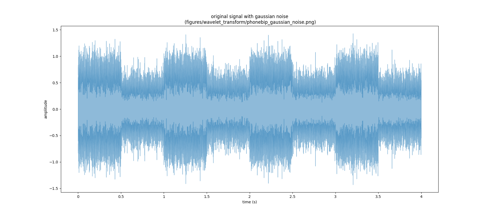

# Scope
The present project aims to use fourier transform method and wavelet transform method to denoise audio sounds.

# Virtual environment
To run this project, please activate the built-in virtual environment by navigating to the parent directory and using the command source `bin/activate` in your terminal. Once activated, no additional requirements are necessary to run the code_project.py file.

# Denoising sounds using Fourier transform and Wavelet transform methods

## Introduction

Sound is an essential part of our lives, and the quality of sound is crucial in many fields, such as music, communication, and medical diagnosis. However, the presence of noise in sound signals can degrade the quality of the sound and make it difficult to analyze or use. Thus, denoising sound signals has become an important area of research in signal processing.

In this project, we will focus on two popular methods of sound denoising, the Fourier Transform method, and the Wavelet Transform method. These methods can remove noise from a sound signal and recover the original signal accurately. We will add Gaussian noise to an original sound and use the Fourier Transform and Wavelet Transform methods to denoise it.

The Fourier Transform method uses the Fourier Transform algorithm to transform the time-domain signal into the frequency-domain signal, where the noise and the original signal can be separated. The noise can then be removed, and the original signal can be recovered by applying the inverse Fourier Transform. The Wavelet Transform method is based on wavelet analysis, which is a mathematical technique that decomposes a signal into different frequency components at different scales. The noise can be removed by thresholding the wavelet coefficients.

In this report, we will present the Fourier Transform method and the Wavelet Transform method in detail, explaining the mathematical concepts behind them. We will also compare the performance of these two methods and evaluate their effectiveness in denoising sound signals.

## I. Fourier Transform (FT) method

### 1) The theory behind Wavelet transform

The Fourier Transform is a continuous mathematical function that transforms a continuous signal from the time domain to the frequency domain.

The fourier transform function is of the form:

Where: 
    - the variable x represents time.
    - ξ is the frequency
    - The function $$f_hat(x)$$ is the transform function of $$f(x)$$ at frequency  ξ.

f(x) represents the time domain of the signal. Given time (x), $$f(x)$$ returns the **Amplitude** of the signal at each time x.

Computing $$f_hat(ξ)$$ for all values of frequencies ξ produces the frequency-domain function. Given, the frequency ξ, $$f_hat(ξ)$$ returns the **Magnitude** of the signal at each frequence.

### 1) Discrete Fourier Transform (DFT)
The DFT is a discrete version of the Fourier Transform function that is used to transform a discrete signal from the time domain to the frequency domain. The DFT breaks down the signal into a finite number of discrete frequency components, making it easier to analyze and process.

### 2) Fast Fourier Transform
The FFT is an efficient and fast algorithm used to compute the DFT of a signal. The FFT algorithm reduces the number of computations required to calculate the DFT from O(N^2) to O(N * log(N)), where N is the length of the sequence. This faculty makes the FFT a much faster alternative to compute the DFT, especially for large data sets.

### 3) Signal denoising using FT method
FT method is known to be an efficient method to denoise signals. To do so, we had chosen to test its ability to denoise a simple phone bip sound signal (`audio/phonebip.wav`).

A zoom on the signal between t=10000 and t=10400 returns a sinusoidal wave.

Using FFT, we can transform our original (clean) signal into frequency domain.

The first step consists in adding a gaussian noise to the original signal (`audio/phonebip_gaussian_noise.wav`).

Then, transform our noised continuous signal from time-domain into frequency-domain. This is done by computing the DFT of our noised signal using the FFT algorithm.

Third, compute the power spectral density (PSD) which shows the power of each frequency of our noised signal.

Fifth, find all frequencies with large power. In other words, keep only frequencies that are higher than a certain threshold. Here, threshold is set to 100 after looking to the frequency domain graph. This gives the clean signal in the frequency domain.

Lastly, transform the obtained clean signal from time-domain to the frequency-domain using the inverse FFT algorithm.

Comparing the difference between the original clean signal and the denoised signal after adding gaussian noise returns an mse of about *mse=0.0005499*.

### 4) Signal decomposition and recomposition using FT method

Here, the idea is to use decompose and recompose the original clean signal without adding any noise.

Using FFT, we can transform our original (clean) signal into frequency domain.

The back way to the time domain after keeping only the frequencies with the highest magnitude is done using the inverse FFT algorithm.

## Wavelet Transform

### 1) The theory behind Wavelet transform

The wavelet transform is a mathematical technique used to analyze signals in both the time and frequency domains. Unlike the Fourier Transform, which uses sinusoidal basis functions to represent a signal, the wavelet transform uses a family of functions known as wavelets [2].

Wavelets are functions that are localized in both time and frequency, which means that they can capture both transient and oscillatory behavior in a signal. The wavelet transform decomposes a signal into a series of wavelets at different scales and positions, allowing for the analysis of both high and low frequency components of the signal.

The wavelet transform of a signal $x(t)$ at scale $a$ and translation $b$ is obtained by scaling and shifting the wavelet function $\psi(t)$ to produce $\psi(a t - b)$, and then computing the inner product of this scaled and shifted wavelet with the signal $x(t)$:

$$W(a,b) = \int_{-\infty}^\infty x(t) \psi^* (a t - b) dt $$

where $*$ denotes the complex conjugate, and $W(a,b)$ represents the wavelet coefficients at scale $a$ and position $b$ [2].

### 2) Signal denoising using Wavelet transform method

As FT method, Wavelet transform method is known to be an efficient method to denoise signals. To do so, we had chosen to test its ability to denoise the same signal as before (`audio/phonebip.wav`). We will then compare the results with our findings when using FT.

The audio signal is first loaded from a file and plotted to visualize the waveform in the time domain. 

Then a zoomed-in plot of a section of the waveform is created to show more detail.

Next, the signal is corrupted by adding Gaussian noise to it.

The best threshold for denoising is determined using a function that takes the noisy signal, the original signal, and a range of threshold values as inputs.

The wavelet transform is then applied to denoise the signal using the best threshold value. 

Finally, the denoised signal is saved to a `.wav` file and plotted for visualization.

## Conclusion

When playing the denoised phone bip file produced by both the fourier transform method (`audio/fourier_transform/phonebip_gaussian_denoise.wav`) and the wavelet transform method (`audio/wavelet_transform/phonebip_gaussian_denoise.wav`), we can notice that the fourier transform performs much better than the wavelet transform method. Moreover, doing the same analysis on a more complex sound such as music (`audio/bassloop.wav`) returns the same result.

The bad performances of he wavelet transform method may be due to a bad choice of the hyper parameters such as the wavelet type, i.g. "db2" or "db10", chosen when applying the wavelet decompositionof the signal. Better results should be returned if we work more about chosing better hyperparameters.

# References
[1]. https://en.wikipedia.org/wiki/Fourier_transform

[2]. https://en.wikipedia.org/wiki/Wavelet